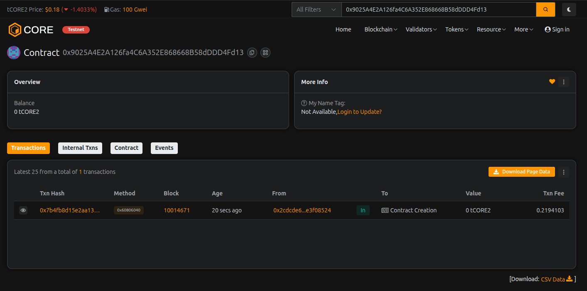

# PolySwap Engine

## Project Description

PolySwap Engine is a decentralized automated market maker (AMM) protocol built on Solidity that enables seamless token swaps through liquidity pools. The protocol implements a constant product formula (x * y = k) similar to Uniswap, allowing users to provide liquidity, earn fees, and execute trustless token swaps without intermediaries.

The smart contract provides a complete DeFi infrastructure with liquidity pool management, automated price discovery, and fair fee distribution. Users can create new trading pairs, add/remove liquidity, and swap tokens with minimal slippage based on pool depth.

## Project Vision

Our vision is to create an accessible, efficient, and transparent decentralized exchange protocol that democratizes liquidity provision and token trading. PolySwap Engine aims to:

- **Empower Users**: Enable anyone to become a liquidity provider and earn passive income from trading fees
- **Eliminate Intermediaries**: Provide a fully decentralized trading experience without centralized control
- **Optimize Capital Efficiency**: Implement advanced AMM mechanisms for better price execution and reduced slippage
- **Foster Innovation**: Build a foundation for multi-chain DeFi applications and composable financial products
- **Promote Transparency**: Ensure all operations are on-chain, auditable, and governed by smart contract logic

## Key Features

### 1. **Liquidity Pool Creation**
- Create custom trading pairs between any two ERC-20 tokens
- Permissionless pool deployment for maximum flexibility
- Automatic pool initialization with first liquidity provision

### 2. **Liquidity Provision**
- Add liquidity to existing pools and receive proportional LP tokens
- Automated liquidity calculation based on constant product formula
- Fair distribution of trading fees to liquidity providers

### 3. **Liquidity Withdrawal**
- Remove liquidity at any time by burning LP tokens
- Receive proportional share of pool reserves
- No lock-up periods or withdrawal penalties

### 4. **Token Swapping**
- Execute instant token swaps using the constant product AMM model
- Automatic price adjustment based on supply and demand
- Protection against excessive slippage with reserve checks

### 5. **Price Quotation**
- Get real-time swap quotes without executing transactions
- Calculate expected output amounts before committing to trades
- Transparent fee structure for informed decision-making

### 6. **Pool Analytics**
- Query detailed pool information including reserves and total liquidity
- Track individual liquidity positions with timestamps
- Monitor pool activity and trading volume

### 7. **Fee Management**
- Platform fee collection on every swap (default 0.3%)
- Adjustable fee parameters for protocol optimization
- Owner-controlled fee withdrawal mechanism

### 8. **Pool Governance**
- Owner controls for pool activation/deactivation
- Emergency pause functionality for security
- Fee parameter adjustments for market conditions

## Future Scope

### Phase 1: Core Enhancements
- **Multi-hop Routing**: Enable swaps through multiple pools for better rates
- **Concentrated Liquidity**: Implement range orders for capital efficiency (similar to Uniswap V3)
- **Flash Swaps**: Allow borrowing assets within a single transaction for arbitrage
- **Oracle Integration**: Provide price feeds for external DeFi protocols

### Phase 2: Advanced Features
- **Governance Token**: Launch native governance token for decentralized protocol management
- **Staking Rewards**: Distribute additional incentives to liquidity providers
- **Limit Orders**: Implement off-chain order matching with on-chain settlement
- **Cross-chain Bridges**: Enable multi-chain liquidity and token swaps

### Phase 3: Ecosystem Expansion
- **NFT Trading Pools**: Support for NFT-to-token liquidity pools
- **Derivatives Market**: Options and futures contracts built on swap infrastructure
- **Lending Integration**: Use LP tokens as collateral in lending protocols
- **DAO Treasury Management**: Automated fund management and fee distribution

### Technical Improvements
- **Gas Optimization**: Implement advanced solidity patterns for reduced transaction costs
- **Security Audits**: Comprehensive third-party audits and bug bounty programs
- **Layer 2 Deployment**: Deploy on Optimism, Arbitrum, and other L2 solutions
- **Analytics Dashboard**: Build comprehensive UI for pool metrics and user positions

### Community & Growth
- **Liquidity Mining Programs**: Incentivize liquidity provision in strategic pairs
- **Partnership Integrations**: Integrate with wallets, aggregators, and DeFi protocols
- **Developer SDK**: Provide tools and libraries for easy integration
- **Educational Resources**: Create documentation and tutorials for users and developers

---

**License**: MIT  
**Solidity Version**: ^0.8.19  
**Contract**: PolySwapEngine.sol

---

## Contract Details: 

Transaction id: 0x9025A4E2A126fa4C6A352E868668B58dDDD4Fd13
